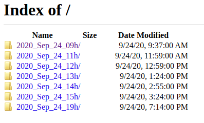

# Others

## Start at boot
The project is way more convenient if the script is running at boot. Here is how to setup simple script and run it at boot:

#### 1 - Starting script
If you install using virtualenv, you will have to activate it, then navigate to your path, and run the main script:
```bash
#!/bin/bash
# Start DroneReco at boot
source /home/pi/.zshrc
sleep 2

# Goto directory
cd /home/pi/Documents/Src/
sleep 1

# Start script into log file
python DroneReco.py -m dev_model.tflite
```

#### 2 - Generate the service
Then you have to generate a service under ```/lib/systemd/system/DroneReco.service``` as:
```bash
[Unit]
Description=Will start DroneReco
After=network.target

[Service]
ExecStart=/home/pi/DroneReco.sh
User=pi

[Install]
WantedBy=multi-user.target
```

#### 3 - Activate the service
Then you have to load and enable the service:
```
sudo systemctl daemon-reload
sudo systemctl enable DroneReco.service
```
Finally check that everything is running with ```systemclt status DroneReco.servce```

## FTP server
Adding an FTPserver accessible from the brower allows to easily access and download the video.
I choose to use [proftpd](http://www.proftpd.org/), because fast an easy to setup following this [guide](https://tutorials-raspberrypi.com/raspberry-pi-ftp-server-installation/).

#### 1 - Install
```
sudo apt-get install proftpd
```

#### 2 - Create Virtual User
Just modify the path to the video folder, here the user name is **testers**:
```
cd /etc/proftpd/
sudo ftpasswd --passwd  --name testers --gid 33 --uid 33 --home /home/pi/Documents/Video --shell /bin/false
```

and the user to the proftp config by adding those line at the end of ```/etc/proftpd/proftpd.conf```:
```
# Add Virtual user
AuthOrder mod_auth_file.c  mod_auth_unix.c
AuthUserFile /etc/proftpd/ftpd.passwd
AuthPAM off
RequireValidShell off
```

#### 3 - Access the file
Once restarted, you should be able to connect the server via: ```ftp://domaine_name or IP```



## Cleaning files
You can run a small script to limit the number of short video (FalseDetection / arming test).
Please set the good ```Video_path``` in ```config.py```, and run
```
python rm_short_video.py
```

You can schedule this script with crontab (here every 10 mins):
```
crontab -e
*/20 * * * * /home/pi/Documents/Others/clean_video.sh